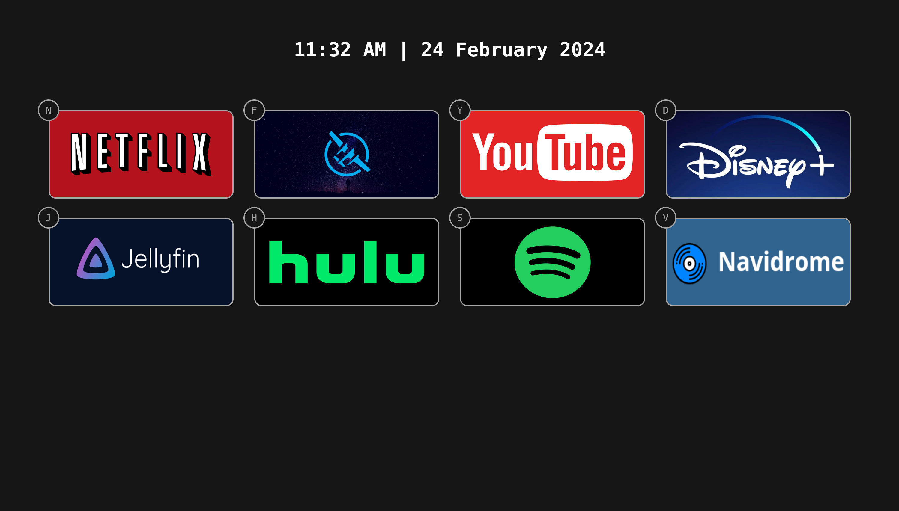

# MediaHome

MediaHome is a self-hostable homepage for all your media services. MediaHome is not meant as a competitor to homelab dashboards like [Homer](https://github.com/bastienwirtz/homer) or [Homepage](https://github.com/gethomepage/homepage). Rather, it is meant to be accessed from a dedicated HTPC to provide a fast and simple way to access content.



## Features

- Configurable with `json`
- Keyboard shortcuts to launch into services

## Deployment

Docker compose:

```yml
---
version: "3"
services:
  homer:
    image: noahhefner/mediahome:latest
    container_name: media-home
    volumes:
      - /path/to/your/config:/usr/share/nginx/html/config
    ports:
      - 8080:80
    user: 1000:1000
```

For `config` example directory, see `/public/config`. Expected `config` directory is:

```
config/
├── config.json
└── images
    ├── service-image-1.png
    └── service-image-2.jpg
```

Example `config.json`:

```json
{
  "appearance": {
    "columns": 4
  },
  "tiles": [
    {
      "service": "Netflix",
      "url": "https://www.netflix.com",
      "image": "netflix-logo.png",
      "keybind": "n",
      "target": "_blank"
    },
    {
      "service": "Hulu",
      "url": "https://www.hulu.com",
      "image": "hulu-logo.jpg",
      "keybind": "h",
      "target": "_blank"
    },
    {
      "service": "Disney",
      "url": "https://www.disneyplus.com",
      "image": "disney-logo.jpeg",
      "keybind": "d",
      "target": "_blank"
    },
    {
      "service": "Youtube",
      "url": "https://www.youtube.com",
      "image": "youtube-logo.jpg",
      "keybind": "y",
      "target": "_blank"
    },
    {
      "service": "Spotify",
      "url": "https://www.spotify.com",
      "image": "spotify-logo.jpg",
      "keybind": "s",
      "target": "_blank"
    }
  ]
}
```

## Roadmap

- [X] Dockerize the application with volume support for configuration files (done-ish, docker-compose is untested)
- [ ] Additional customization options (colors, toggle keyboard shortcut visibility, etc.)

## Development

Prerequisites:

- `node.js`
- `npm`
- `docker`

Makefile commands:

| Command | Description |
|---------|-------------|
| `make dev` | Build and run through node. Available at `localhost:5173` |
| `make build` | Build the Docker image. |
| `make run` | Run the Docker image. Available at `localhost:8080` |
| `make clean` | Delete `dist` directory and delete Docker image with `latest` tag |
| `make publish` | Publish image to Docker Hub |
