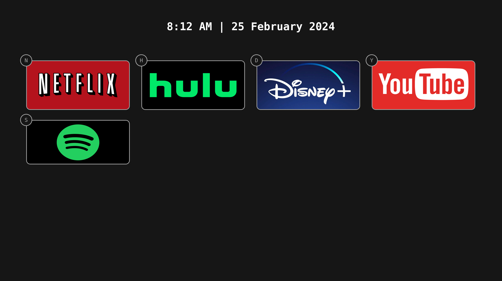

# MediaHome

MediaHome is a self-hostable homepage for all your media services. MediaHome is not meant as a competitor to homelab dashboards like [Homer](https://github.com/bastienwirtz/homer) or [Homepage](https://github.com/gethomepage/homepage). Rather, it is meant to be accessed from a dedicated HTPC to provide a fast and simple way to access content.

## Features

- Configurable with `json`
- Keyboard shortcuts to launch into services

## Roadmap

- [ ] Dockerize the application with volume support for configuration files
- [ ] Additional customization options (colors, toggle keyboard shortcut visibility, etc.)

## Development

1. Install `node.js` and `npm`.
2. Run `make dev`.